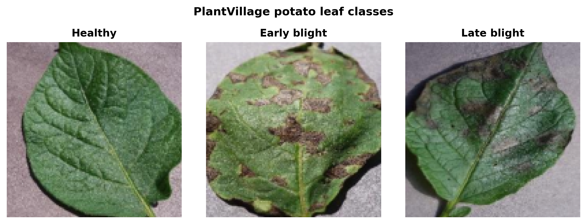
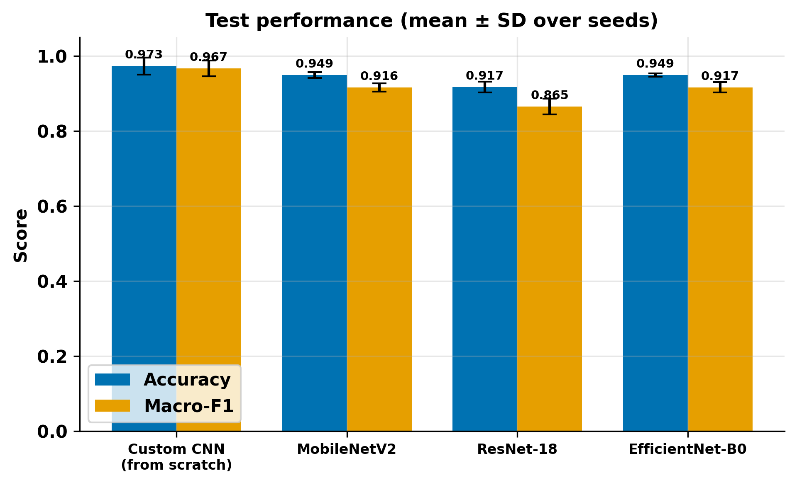
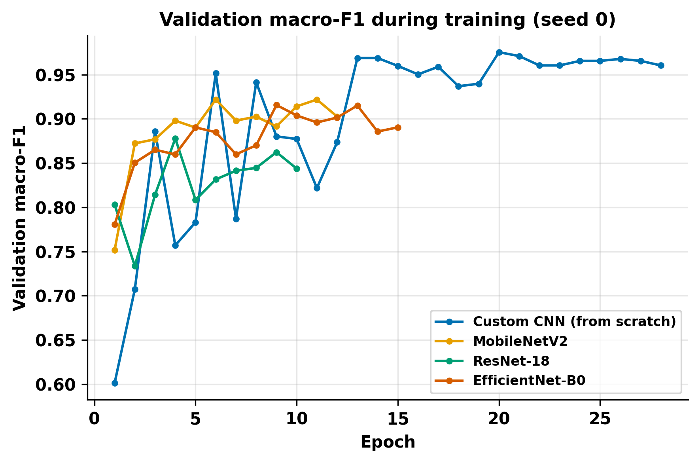
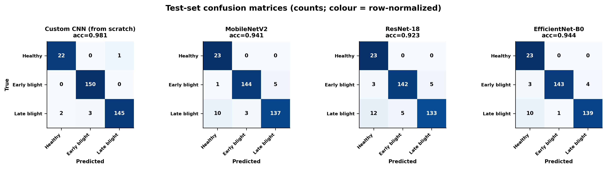
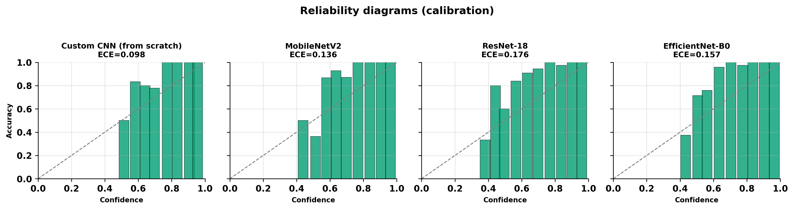
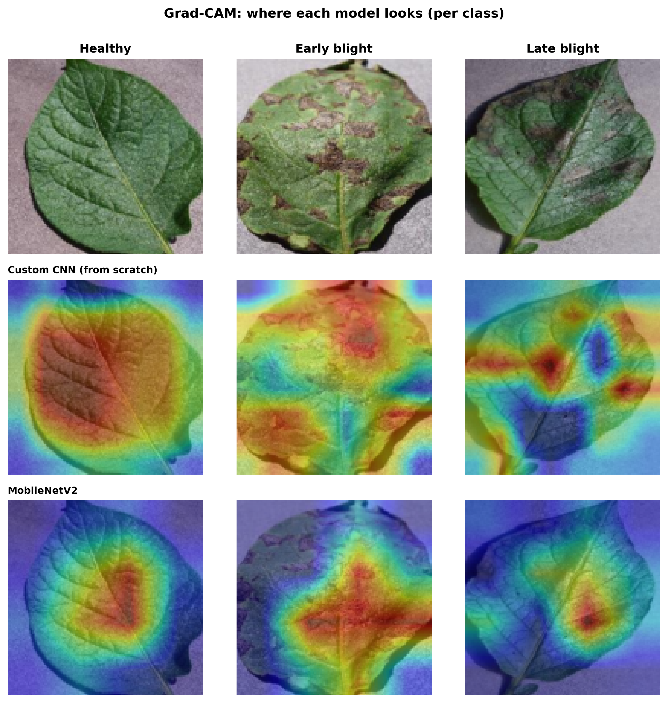

<!-- _class: lead -->
<!-- _paginate: false -->
<!-- _header: "" -->
<!-- _footer: "" -->

# CNN ligeras para el diagnóstico de enfermedades en hoja de papa con hardware de consumo

### Entrenamiento desde cero frente a aprendizaje por transferencia, con interpretabilidad Grad-CAM

**Niels Pacheco**
MIA-07: Redes Neuronales y Aprendizaje Profundo (Sección C)
Proyecto Final · Junio de 2026

---

## ¿Por qué la papa? ¿Por qué ahora?

- La papa (*Solanum tuberosum*) se domesticó en los Andes peruanos hace unos 7,000 años y es el tercer cultivo alimentario más importante del mundo.
- El tizón tardío (*Phytophthora infestans*) causó la hambruna irlandesa y puede arrasar un campo en pocos días; el tizón temprano (*Alternaria solani*) también está muy extendido.
- El diagnóstico experto es escaso en las comunidades rurales andinas, justo donde se concentra el cultivo.
- El aprendizaje profundo podría democratizar el diagnóstico a partir de una sola foto de hoja, siempre que corra en el hardware que los agricultores realmente tienen.

---

## La pregunta de investigación

> **¿Qué tan cerca puede llegar una CNN pequeña entrenada _desde cero_ en una laptop sin GPU al aprendizaje por transferencia preentrenado en ImageNet** para clasificar enfermedades en hoja de papa?

Dos vacíos en la literatura que abordamos:

1. La mayoría de los sistemas asume GPU y grandes redes preentrenadas.
2. Las exactitudes reportadas rara vez vienen con intervalos de confianza, calibración, o una verificación de que el modelo mire la enfermedad.

---

## Contribuciones

1. Una CNN propia compacta (0.33 M parámetros) entrenable de extremo a extremo en CPU o Apple Silicon, comparada con tres modelos de transferencia (MobileNetV2, ResNet-18 y EfficientNet-B0 con red base congelada).
2. Una evaluación con varias semillas, intervalos de confianza por bootstrap al 95% y prueba pareada de McNemar, en lugar de un único número.
3. Un análisis de calibración (ECE y diagramas de fiabilidad), poco frecuente en este dominio.
4. Un estudio de interpretabilidad con Grad-CAM que examina el sesgo de fondo de PlantVillage.
5. Una publicación de código abierto reproducible: dependencias fijadas, semillas fijas, un comando.

---

## Datos: PlantVillage (subconjunto de papa)

- 2,152 imágenes, 3 clases: sana, tizón temprano y tizón tardío
- Fotos controladas en laboratorio, con clases desbalanceadas (pocas sanas)
- Partición estratificada fija 70/15/15, que da 1506 / 323 / 323 imágenes
- El mismo conjunto de prueba para todos los modelos, requisito para una prueba de significancia válida
- Los fondos son muy uniformes, algo que retomamos al final

---

## Datos: ejemplos por clase



<span class="small">Imágenes representativas del conjunto de prueba reservado. Los fondos uniformes son una propiedad que, como mostramos, los modelos pueden explotar.</span>

---

## Cuatro modelos, una comparación justa

| Modelo | Origen | Parámetros |
|-------|--------|--------|
| **CNN propia** | **desde cero** | ~0.33 M |
| MobileNetV2 | ImageNet, congelada + cabezal nuevo | ~2.2 M |
| ResNet-18 | ImageNet, congelada + cabezal nuevo | ~11 M |
| EfficientNet-B0 | ImageNet, congelada + cabezal nuevo | ~4 M |

- Mismo preprocesamiento y normalización ImageNet para todos, así sólo cambian la arquitectura y los pesos
- En transferencia: red base congelada y se entrena sólo un cabezal de clasificación nuevo

---

## La CNN propia (desde cero)

- 4 bloques convolucionales: cada bloque es 2 × (Conv 3×3 + BatchNorm + ReLU) seguido de max pooling
- Anchos de canal 24, 48, 96, 96 (crecen y luego se estabilizan para mantenerla compacta)
- Global average pooling, dropout 0.3 y un clasificador lineal
- 328,587 parámetros totales, todos entrenables de extremo a extremo
- Entradas de 128×128 y normalización ImageNet, igual que las líneas base

---

## Metodología: entrenamiento

- AdamW con planificación coseno de la tasa de aprendizaje
- Entropía cruzada ponderada por clase y suavizado de etiquetas, para contrarrestar el desbalance
- Parada temprana sobre el F1 macro de validación
- 3 semillas aleatorias por modelo; reportamos media y desviación estándar
- Hiperparámetros elegidos por búsqueda sobre el conjunto de validación (el de prueba nunca se consulta)
- Entrenado por completo en Apple Silicon (MPS), sin GPU

---

## Metodología: evaluación y estadística

- Exactitud y F1 macro (robusto al desbalance), como media y desviación estándar sobre 3 semillas
- Intervalos de confianza por bootstrap no paramétrico al 95% por corrida
- Prueba pareada de McNemar sobre el conjunto de prueba compartido (binomial exacta cuando hay pocas discordancias)
- Calibración con ECE y diagramas de fiabilidad
- Grad-CAM para ver dónde mira cada modelo

---

## Resultados: tabla principal

| Modelo | Params | Exactitud (%) | F1 macro (%) | ECE |
|--------|-------:|:---:|:---:|:---:|
| **CNN propia (desde cero)** | **328,587** | **97.3 ± 2.3** | **96.7 ± 2.1** | **0.123** |
| EfficientNet-B0 | 4,011,391 | 94.9 ± 0.5 | 91.7 ± 1.4 | 0.157 |
| MobileNetV2 | 2,227,715 | 94.9 ± 0.8 | 91.6 ± 1.2 | 0.134 |
| ResNet-18 | 11,178,051 | 91.7 ± 1.5 | 86.5 ± 2.1 | 0.171 |

<span class="small">Media y desviación estándar sobre 3 semillas. La CNN propia es la mejor en exactitud, F1 macro y calibración, con 7 a 34 veces menos parámetros.</span>

---

## Resultados: la CNN desde cero rinde mejor



- F1 macro de 96.7%, frente al 91.7% de la mejor transferencia (EfficientNet-B0)
- McNemar: supera de forma significativa a los tres modelos de transferencia (p = 0.017, 0.004, 7e-5)
- Las características congeladas de ImageNet no están adaptadas al dominio

---

## Curvas de entrenamiento



- Las redes base preentrenadas convergen rápido; la CNN desde cero converge más lento hasta un nivel similar
- Todos alcanzan una meseta alta dentro del presupuesto de entrenamiento

---

## Estructura de confusión



- Los errores de la CNN propia son casi todos confusiones entre las dos enfermedades, algo operativamente benigno porque ambas requieren acción
- La transferencia, en cambio, clasifica algo de tizón tardío como sana (10 a 12 de 150): falsos negativos peligrosos
- La CNN propia no sólo puntúa más alto, también falla de forma más segura

---

## Calibración



- Todos los modelos están moderadamente mal calibrados (ECE entre 0.12 y 0.17)
- La CNN propia es la mejor calibrada; la mala calibración viene sobre todo de la confianza media
- Un sistema desplegado se beneficiaría del escalado por temperatura antes de confiar en las probabilidades

---

## ¿Dónde miran los modelos?



- Atienden a las lesiones, pero también a los bordes de la hoja y al fondo
- Es consistente con el sesgo de fondo de PlantVillage (Noyan 2022; Barbedo 2018)
- Por tanto, la exactitud de laboratorio es una cota superior del desempeño en campo

---

## Discusión

**Lo que sí podemos afirmar**
- Una CNN pequeña entrenada desde cero en una laptop supera de forma significativa a la transferencia de red base congelada, con 7 a 34 veces menos parámetros.
- Bajo un presupuesto de cómputo igualmente bajo, aprender características del dominio de extremo a extremo vence a reutilizar características congeladas de ImageNet.

**Lo que no debemos afirmar**
- Que una alta exactitud en PlantVillage signifique que está listo para el campo. El sesgo de fondo lo impide.
- Que la transferencia sea peor en general: el ajuste fino completo probablemente cerraría la brecha.

---

## Limitaciones y trabajo futuro

**Limitaciones**
- Imágenes de laboratorio con fondos limpios; en campo esperamos que todos los modelos se degraden.
- Tarea de 3 clases comparativamente fácil, lo que comprime las diferencias entre arquitecturas.
- Redes base congeladas (no ajuste fino completo), calibración moderada y sin despliegue en dispositivo todavía.

**Trabajo futuro**
- Evaluación con imágenes de campo, eliminación o segmentación del fondo, y medición de latencia y energía en dispositivo.

---

## Conclusiones y reproducibilidad

- La CNN compacta entrenada desde cero supera de forma significativa a la transferencia congelada en este problema, bajo un presupuesto de bajo cómputo igual; el ajuste fino completo costaría más.
- Grad-CAM revela una dependencia compartida del fondo del conjunto, que matiza todas las exactitudes reportadas.
- Todo se reproduce con un solo comando (entorno `uv` fijado, semillas fijas, figuras y artículo auto-generados):

```bash
make setup && make data && make train-all && make eval && make figures && make paper
```

Repositorio: github.com/nielspac177/papa-vision · ¡Gracias! · nielspacheco1997@gmail.com
